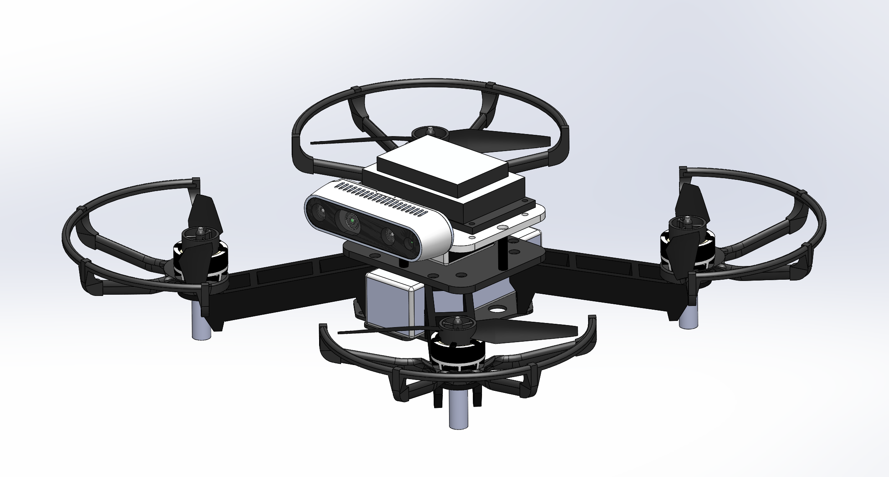

### update!

Now the English version of the readme is available at [readme-english-ver.md](readme-english-ver.md).

# FASTLAB 自主导航无人机硬件

## 0.概要

本项目主要介绍浙江大学FASTLAB实验室使用的自主导航无人机的硬件组成与搭建，本无人机可应用于无人机在未知环境中的自主飞行，集群飞行等等，以下工作都以本无人机为基础：[Ego-Planner](https://github.com/ZJU-FAST-Lab/ego-planner) [Ego-Swarm](https://github.com/ZJU-FAST-Lab/ego-planner) [CMPCC](https://github.com/ZJU-FAST-Lab/CMPCC) [Fast-Tracker](https://github.com/ZJU-FAST-Lab/Fast-tracker) [Fast-Racing](https://github.com/ZJU-FAST-Lab/Fast-Racing) 等

## 1. 无人机硬件基本组成

+ 一个可以用遥控器控制飞行的无人机，需要的基本硬件有：*机架，电机，电调，飞控，接收机，遥控器，锂电池，BB响（电压计）*等

+ 自主导航无人机在基本硬件基础上，还需要***双目相机***用于视觉定位，***机载电脑***用于运行导航算法等等。

  下表为各部件型号，数量，与购买链接

  | 类目             | 型号                 | 数量 | 单价 | 总价 | 淘宝链接                                                     |
  | ---------------- | -------------------- | ---- | ---- | ---- | ------------------------------------------------------------ |
  | 机架             | QAV250               | 1    | 38   | 38   | https://item.taobao.com/item.htm?spm=a1z09.2.0.0.2abd2e8da0sHzh&id=520738516076&_u=l32egecqf290 |
  | 电调             | 银燕45A              | 4    | 89   | 356  | https://item.taobao.com/item.htm?spm=a1z09.2.0.0.2abd2e8da0sHzh&id=627250691828&_u=l32egecq104a |
  | 电机             | T-MOTOR F60 KV2550   | 4    | 159  | 636  | https://item.taobao.com/item.htm?spm=a230r.1.14.6.58866126r2mH5j&id=612118488792&ns=1&abbucket=3#detail |
  | 飞控             | CUAV NORA            | 1    | 1669 | 1669 | https://item.taobao.com/item.htm?spm=a1z09.2.0.0.2abd2e8da0sHzh&id=618340579779&_u=l32egecq6321 |
  |                  | V5+                  | 1    | 1499 | 1499 | https://item.taobao.com/item.htm?spm=a1z10.5-c-s.w4002-22188405087.10.39df7ad6BKLAJz&id=594262853015 |
  |                  | X7                   | 1    | 1999 | 1999 | https://item.taobao.com/item.htm?spm=a1z10.5-c-s.w4002-22188405087.22.39df7ad6BKLAJz&id=617384615131 |
  | 机载电脑         | DJI MANIFOLD2-C      | 1    | 8799 | 8799 | https://m.dji.com/cn/product/manifold-2                      |
  |                  | JETSON XAVIER NX     | 1    | 6800 | 6800 | https://detail.tmall.com/item.htm?spm=a230r.1.14.33.351a587bMPOWBh&id=619740546745&ns=1&abbucket=3&skuId=4573153270812 |
  |                  | NX载板               | 1    | 889  | 889  | https://item.taobao.com/item.htm?spm=a1z09.2.0.0.40df2e8dWJlaLW&id=613984388047&_u=s32egecqa8ff |
  | 双目相机         | INTEL REALSENSE D435 | 1    | 1590 | 1590 | https://item.taobao.com/item.htm?spm=a1z09.2.0.0.2abd2e8da0sHzh&id=638877621060&_u=l32egecq42d1 |
  | 遥控器           | 乐迪 AT9S PRO        | 1    | 580  | 580  | https://item.taobao.com/item.htm?spm=a1z09.2.0.0.2abd2e8da0sHzh&id=533085053894&_u=l32egecq481a |
  | 接收机           | 乐迪 R12DSM          | 1    | 94   | 94   | https://item.taobao.com/item.htm?spm=a1z09.2.0.0.2abd2e8da0sHzh&id=541658831753&_u=l32egecq5116 |
  | 碳纤维板         | 定制                 | 1    | 80   | 80   | https://item.taobao.com/item.htm?spm=a1z09.2.0.0.2abd2e8da0sHzh&id=628187754851&_u=l32egecq8290 |
  | USB网卡          | EDIMAX EW7822ULC     | 1    | 188  | 188  | https://item.jd.com/10022884495770.html                      |
  | 3D打印件         | 定制                 | 1    | 100  | 100  | https://wenext.cn/                                           |
  | 电池             | 格氏 2300mAh 4S      | 4    | 125  | 500  | https://item.taobao.com/item.htm?spm=a1z09.2.0.0.2abd2e8da0sHzh&id=583311920871&_u=l32egecq9cf8 |
  | TYPEC连接线      | 30cm                 | 2    | 27   | 54   | https://detail.tmall.com/item.htm?id=617461584216&spm=a1z09.2.0.0.2abd2e8da0sHzh&_u=l32egecq0e19 |
  | 桨叶             | 乾丰51477            | 10   | 14   | 140  | https://item.taobao.com/item.htm?spm=a1z09.2.0.0.2abd2e8da0sHzh&id=627007813072&_u=l32egecqfabf |
  | 定位相机（可选） | INTEL REALSENSE T265 | 1    | 1600 | 1600 | https://item.taobao.com/item.htm?spm=a1z09.2.0.0.2abd2e8da0sHzh&id=638877621060&_u=l32egecq42d1 |
  |                  |                      |      |      |      |                                                              |
  | 硅胶线           |                      | 若干 |      |      |                                                              |
  | BB响             |                      | 1    |      |      |                                                              |
  | 杜邦线           |                      | 若干 |      |      |                                                              |
  | XT60母头         |                      | 1    |      |      |                                                              |

  其中，飞控可选型号为CUAV NORA,V5+,X7，其他支持px4固件的飞控也可选用。机载电脑可选用DJI MANIFOLD 2-C 或 JETSON XAVIER NX。

  3D打印件与碳板的STL模型可以在model目录下找到

  ## 2. 三维模型

  + 机载电脑挂载MANIFOLD 2-C：

  

+ 机载电脑挂载XAVIER NX：

  

## 3. 机载电脑环境

本无人机运行Ubuntu 16.04/18.04 与 ROS Kinetic/Melodic，相关安装说明详见 [ROS安装](http://wiki.ros.org/ROS/Installation)

## 4. 装机

装机主要难点在于动力套件的焊接与飞控的设置及调试，请移步[assemble.pdf](assemble.pdf)机载电脑的安装可以根据不同的机载电脑自己安装。